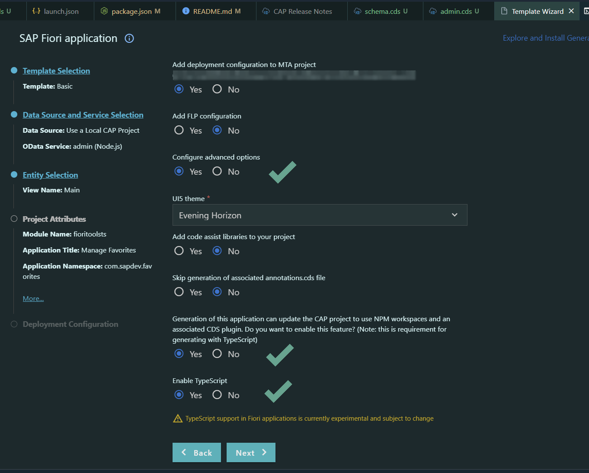

# Getting Started

Project is genarated as a CAP application with the Application Generator:
Options

- HANA
- MTA

After *Fiori:Open Application Generator* Wizard was used to generate a **Basic**  freestyle project based on the Basic CAP service already implemented.
Options

- Advanced
- CDS Plugin Usage
- TypeScript

Note that this project setup is not using CAP service authorizations and fiori-tools-proxy to authenticate. Goal is to demonstrate TypeScript in CAp and Fiori in combination with flexible programming model.



Flexble programming model usage explained: https://github.com/SAP-samples/ui5-exercises-codejam/tree/09a7db78e291ecdfedc0c0e22ed02f7ddb3af2d6/chapters/2.01-fe-fpm

Evolution of UI5 TypsScript: https://github.com/SAP-samples/ui5-typescript-tutorial/tree/main/exercises/ex1
Fiori Flexible Programming model in practice: https://github.com/SAP-samples/ui5-exercises-codejam/tree/09a7db78e291ecdfedc0c0e22ed02f7ddb3af2d6/chapters/2.01-fe-fpm

Notes: do not mix Ui5 Tooling and Fiori Toolkit features and they combination with CAP :D

2nd UI development outlook:
Realize with latest UI5 typescript tutorial: https://github.com/SAP-samples/ui5-typescript-tutorial/tree/main

## Setup root modules

```sh
npm install typescript -–save-dev
npm install @types/node --save-dev
```

## Add typescript configuration to tsconfig.json

Check the file and see how You can configure the build folder

## Add SQLite for development

`npm add @cap-js/sqlite -D`

Temporary removed at the end from package.json hana as db so that sqlite works without *--profile* during development

```json,
  "cds": {
    "requires": {
      "db": "hana"
    }
  }
```

## Added demo content to

- db
- srv

## Generate Frontend

Fiori Application Generator: Basic Template with TypeScript support


It contains these folders and files, following our recommended project layout:


| File or Folder | Purpose                              |
| ---------------- | -------------------------------------- |
| `app/`         | content for UI frontends goes here   |
| `db/`          | your domain models and data go here  |
| `srv/`         | your service models and code go here |
| `package.json` | project metadata and configuration   |
| `readme.md`    | this getting started guide           |

## Next Steps

- Start adding content, for example, a [db/schema.cds](db/schema.cds)
- Add .ts files in service folder service
- Open a new terminal and execute `npm run start-ts`, this will launch the CAP service with node-ts without translating it to .js files. This is not recommended for production.
- To build the service for production, execute `cds build`, this will place the service files into the gen folder, then execute `tsc` to compile the service folder .ts to .js files into the gen folder as well

## Learn More

Learn more at https://cap.cloud.sap/docs/get-started/.
